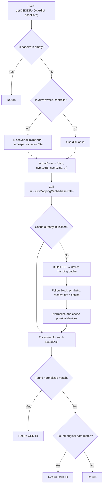

# diskhealthmetrics

This package provides disk-to-OSD mapping logic for Ceph clusters deployed via Rook, especially useful for monitoring and exporting health metrics via Prometheus.

It maps physical block devices (e.g., `/dev/sdX`, `/dev/nvmeXnY`) to their corresponding Ceph OSD IDs, resolving through device-mapper stacks if needed.

## Features

- ✅ Maps `/dev/sdX`, `/dev/nvmeXnY`, and `/dev/mapper/...` to Ceph OSD IDs
- ✅ Supports LVM and complex `dm-*` chains
- ✅ Handles NVMe controllers with multiple namespaces (n1, n2, n3, etc.)
- ✅ Container-friendly: uses simple device file checks, no sysfs dependencies
- ✅ Dual-path cache for raw and normalized device names
- ✅ No `dmsetup` dependency — uses sysfs and Golang syscalls
- ✅ Robust logging and defensive behavior in container environments

---

## How It Works

When you call `getOSDIDForDisk(diskPath, basePath)`, the system:

1. Detects and normalizes the device path
2. Handles NVMe controllers (`/dev/nvmeX`) by discovering all namespaces (`nvmeXn1`, `nvmeXn2`, etc.)
3. Initializes a cache from Rook's OSD `block` → device mapping
4. Follows `dm-*` chains to map logical devices to real block devices
5. Looks up the normalized device in the cache and returns the OSD ID

---

## NVMe Controller Support

The package automatically handles NVMe controller devices using efficient filesystem globbing:

- **Input**: `/dev/nvme1` (controller device)
- **Discovery**: Uses `filepath.Glob("/dev/nvme1n*")` to find all namespaces
- **Efficiency**: Only checks existing namespace devices, no arbitrary limits
- **Mapping**: Maps any discovered namespaces to their corresponding OSD IDs
- **Container-Safe**: Uses simple filesystem globbing, no sysfs dependencies

This works reliably in Kubernetes pods and automatically discovers all available namespaces.

---

## Mermaid Flowchart



## Example Usage
```go
disk := "/dev/nvme13"
basePath := "/var/lib/rook/rook-ceph/"
osdID, err := getOSDIDForDisk(disk, basePath)
if err != nil {
    log.Warn().Err(err).Msg("Failed to map disk to OSD")
} else if osdID != "" {
    log.Info().Str("disk", disk).Str("osd_id", osdID).Msg("Mapped successfully")
} else {
    log.Warn().Str("disk", disk).Msg("No OSD ID found")
}
```

## Key Changes from Previous Version

- **Simplified NVMe Discovery**: No longer relies on `/sys/class/nvme` which may not be available in containers
- **Inline Namespace Detection**: Uses simple device file existence checks for better container compatibility
- **Multiple Namespace Support**: Discovers all namespaces (n1, n2, n3, etc.) up to n32
- **Container-Safe**: Works reliably in Kubernetes pods with limited sysfs access